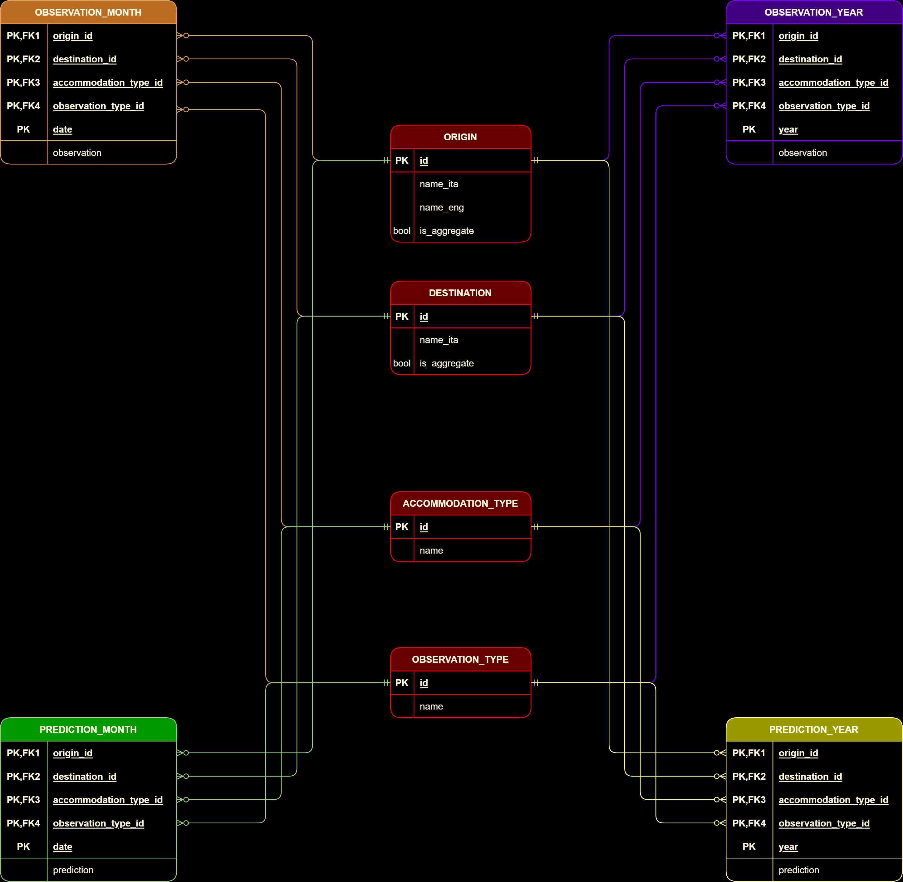

# Touristats

This is a web application that gathers and analyses data about the tourism industry in Sardinia. 

Data has been acquired from the official [Istat](https://www.istat.it/) datasets.

---

## Features
- Data visualization with charts and filters
- Generation of forecasts on future tourism trends
- Scheduled services for ```historical data gathering```, ```ML model training``` and ```forecast data generation```

---

## Used technologies

### Back-End
- Spring Boot
- Docker
- Apache Kafka
- Redis
- MariaDB

### Front-End
- React.js with Next.js as a framework 
- Tailwind CSS framework
- Third party React libraries: daisyui, chartJS

### FinTech
- Python
- Flask

---

## Project's Infrastructure


## Database Schema



---

## Configuration

>:warning: In order to work on the project you need to install [Docker](https://www.docker.com/) on your device.

Depending on the development stage and/or Server resources you can choose one of the following options:

### [1. <em>labintegrato_STATEA_dev</em>](./Setup/Docker_Setup/labintegrato_STATEA_dev/readme.md)

Docker setup for Back-End development

### [2. <em>labintegrato_STATEA</em>](./Setup/Docker_Setup/labintegrato_STATEA/readme.md)

Docker setup for Production deployment

### [3. <em>labintegrato_STATEA_lite</em>](./Setup/Docker_Setup/labintegrato_STATEA_lite/readme.md)

Docker Setup for Production deployment. Kafka queues and scheduled services have been removed in order to reduce memory footprint

---

## Contents

### [<em>infrastructure.png</em>](./infrastructure.png)

Project's infrastructure overview

### [<em>DBusers</em>](./DBusers.md)

List of DB users after importing [DB dump](./stateadb_dump.sql)

### [<em>schema.png</em>](./schema.png)

DB schema diagram

### [<em>stateadb_dump.sql</em>](./stateadb_dump.sql)

DB data and schema dump

### [<em>Setup</em>](./Setup/readme.md)

It contains all the files necessary for the initial setup of the Back-End

### [<em>SpringServices</em>](./SpringServices/readme.md)

It contains the source code for the main services of the Back-End

---

## Contributors

### Back-End
- [Emilio Gasbarro](https://github.com/Elanigiro)
- [Matteo Taricco](https://github.com/teo1223)
### Front-End
- [Federico Stroppiana](https://github.com/FedericoStroppiana)
- [Giampietro Piras](https://github.com/KelosDev)
- [Joele Melchiorre](https://github.com/WebDevJoJo)
- [Sebastiano Demichelis](https://github.com/deeeemiss)
### FinTech
- [Fabio Leoni](https://github.com/Fazzina)
- [Matteo Drago](https://github.com/Kindaglia)
